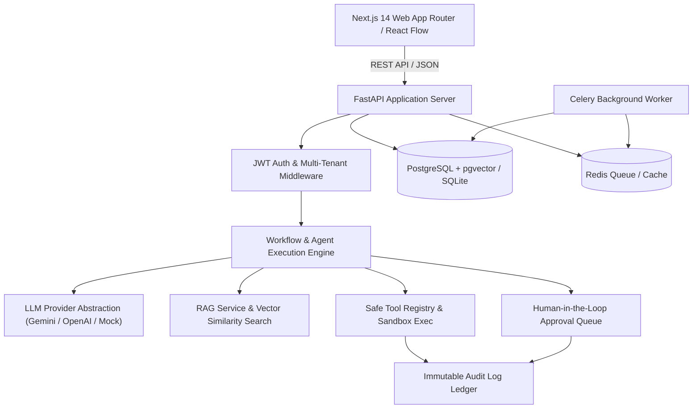

# OPS PILOT
### AI-Powered Business Operations & Workflow Automation Platform

> **Flagship Engineering Case Study & Reference Implementation**  
> *Demonstrating enterprise AI agents, pgvector RAG, safe LLM function calling, multi-tenant architecture, human-in-the-loop safety gates, and immutable audit trails.*

---

## 🌟 Executive Overview & Product Vision

**OPS PILOT** is a real, production-quality platform designed to automate repetitive business operational workflows using AI while maintaining strict human oversight and enterprise security.

```
Incoming Request / Customer Inquiry
        ↓
Intent & Priority Classification
        ↓
Entity & Parameter Extraction
        ↓
Knowledge Retrieval (pgvector RAG)
        ↓
AI Agent Reasoning & Decision Generation
        ↓
Monetary & Business Rule Evaluation
        ↓
Tool / Action Risk Evaluation
        ↓
Human Approval Gate (If High Risk)
        ↓
Simulated Sandbox Action Execution
        ↓
Immutable Audit Log & Observability
```

---

## 🏗️ System Architecture



---

## ⚡ Primary Use Case: Customer Support & Operations Automation

### Scenario: Duplicate Billing & Refund Workflow

1. **Customer:** *"I was charged twice for my subscription ($49.00). Transaction ID TXN-9941."*
2. **Intent Classification Node:** Categorizes request as `Billing & Financial` (Priority: `High`).
3. **Extraction Node:** Extracts `amount: 49.00`, `transaction_id: TXN-9941`, `email: jane.doe@acme-corp.com`.
4. **Knowledge Retrieval Node (RAG):** Performs vector similarity lookup in knowledge base, retrieving `Subscription Refund Policy v2.4` (Section 1: Duplicate Charges require human approval if amount >= $25.00).
5. **AI Reasoning Node:** Generates recommendation: *"Issue 100% refund of $49.00 for duplicate transaction TXN-9941."*
6. **Condition Node:** Evaluates monetary risk ($49.00 >= $25.00 threshold).
7. **Human Approval Gate:** Pauses execution and queues request in `/approvals`.
8. **Human Reviewer:** Reviews customer context, AI recommendation, and RAG policy evidence, then clicks **Approve**.
9. **Tool Execution Node:** Dispatches `refund_payment_simulation` sandbox API action.
10. **Audit Log:** Writes immutable event log entries for every step.

---

## 📂 Codebase Directory Structure

```
bold-galileo/
├── backend/                      # Python FastAPI Application
│   ├── app/
│   │   ├── api/                  # REST Routers (auth, workflows, executions, approvals, knowledge, audit_logs, dashboard, metrics)
│   │   ├── core/                 # Config & Security (JWT, bcrypt)
│   │   ├── db/                   # Database session, models, seed script
│   │   ├── providers/            # LLM Provider Abstractions (Base, Gemini, OpenAI, Mock)
│   │   ├── schemas/              # Pydantic v2 validation models
│   │   └── services/             # Core engines (workflow_engine, rag_service, tool_registry, approval_service, audit_service)
│   ├── tests/                    # Pytest integration test suite
│   ├── pyproject.toml
│   └── main.py
├── frontend/                     # Next.js 14 App Router Web UI
│   ├── src/
│   │   ├── app/                  # App pages (/login, /dashboard, /workflows, /executions, /approvals, /knowledge, /audit-logs, /case-study)
│   │   ├── components/           # Navigation, QueryProvider, UI components
│   │   ├── lib/                  # API client, TypeScript utilities
│   │   └── types/                # TypeScript interfaces
│   ├── package.json
│   └── tailwind.config.js
├── worker/                       # Celery async background task worker
├── docs/                         # Architecture documentation & ADRs
│   ├── ARCHITECTURE.md
│   ├── SECURITY.md
│   ├── API.md
│   ├── CONTRIBUTING.md
│   └── architecture-decisions/   # ADR-001 through ADR-005
├── infrastructure/               # Terraform HCL & Observability configs
│   ├── main.tf
│   ├── prometheus.yml
│   └── grafana-dashboard.json
├── tests/load/                   # k6 load testing scripts
└── docker-compose.yml            # Multi-container production stack
```

---

## 🚀 Quick Start Guide

### 1. Running Backend & Pytest Suite Locally

```bash
# Navigate to project root
cd bold-galileo

# Activate virtual environment
source backend/venv/bin/activate

# Run backend Pytest test suite
PYTHONPATH=. backend/venv/bin/pytest backend/tests/ -v

# Run FastAPI server
PYTHONPATH=. backend/venv/bin/python backend/main.py
```

FastAPI server runs on `http://localhost:8000` (OpenAPI Docs at `http://localhost:8000/docs`).

### 2. Running Frontend Locally

```bash
cd frontend
npm run dev
```

Next.js frontend runs on `http://localhost:3000`.

### 3. Containerized Deployment with Docker Compose

```bash
docker-compose up --build -d
```

---

## 🧪 Testing & Load Testing

### Automated Backend Integration Tests

The Pytest suite tests authentication, multi-tenant data isolation, node-based workflow engine state transitions, RAG similarity search, human approval gates, and audit log generation:

```bash
PYTHONPATH=. backend/venv/bin/pytest backend/tests/ -v
```

### k6 Load Testing

Run the performance benchmark script:

```bash
k6 run tests/load/k6-workflow-test.js
```

---

## 🔒 Security Posture

- **Strict Multi-Tenant Scoping:** Database- and query-level `org_id` scoping prevents cross-tenant data leaks.
- **Zero Arbitrary Code Execution:** All tool calls map to schema-validated functions registered in `tool_registry.py`.
- **Password Hashing:** Passwords hashed with `bcrypt` with work factor 12.
- **Human Approval Gates:** High-risk actions require explicit human authorization before tool execution.

---

## 📊 Observability & Metrics

- **Prometheus Metrics:** Exposed at `/metrics` (tracks request throughput, workflow execution latency, error counts).
- **Grafana Dashboard:** Configuration available in `infrastructure/grafana-dashboard.json`.
